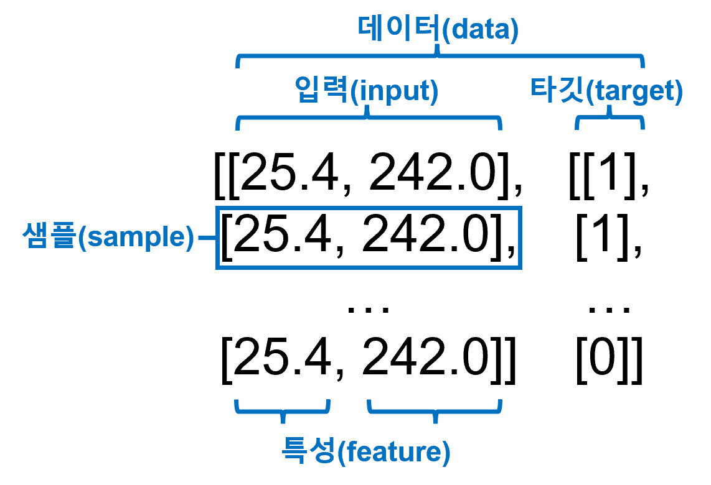

# 1주차 머신러닝 시작
머신러닝 용어와 데이터 전처리의 필요성

# 머신러닝 개념

## 분류(Classification)

여러 종류(**Class**)에서 하나의 종류로 구별해 내는 문제

## 머신러닝 학습 종류

-   **비지도학습** : 데이터와 타깃을 이용하여 데이터의 종류(Class)를 알려주는 학습
-   **지도학습** : 데이터만을 이용하여 데이터의 종류(Class)는 알아서 학습
-   **강화학습** : 알고리즘이 행동한 결과로 얻어지는 보상을 기준으로 학습

## 데이터 용어 정리



## 샘플링 편향(sampling bias)

훈련 세트 or 테스트 세트에 샘플이 종류(class)별로 골고루 섞이지 않은 것

샘플링 편향이 발생하면 **부적절한 결과가 도출될 수 있음**

## K-최근접 이웃(K-NN, K Nearest Neighbor) 알고리즘

가장 가까이 있는 **K개**의 데이터를 기준으로 데이터를 판별하는 알고리즘

## 데이터 전처리의 필요성

-   **스케일(scale)** : 각 특성들의 단위
-   **데이터 전처리** : 데이터들의 특성값을 일정한 기준으로 맞춰주는 작업 K-NN 알고리즘에서는 데이터 간의 스케일(scale)을 통일 해주는 방법이 있음
-   **표준점수(= z 점수)(standard score)** : 특성값이 평균에서 표준편차의 몇 배만큼 떨어져 있는 지 나타냄;

$$ Z_i = \frac{X_i - E(X)}{\sigma} $$

\Large Z_i = \frac{X_i - E(X)}{\sigma}
 

-   통계 관련 자료

[수식 없는 표준편차](https://www.youtube.com/watch?v=XrL2SbwAfhE)

[분산의 정의 알아보기](https://www.youtube.com/watch?v=3rSecBOH_EQ)

# 라이브러리 사용법

## 맷플롯립(matplotlib)

데이터들을 시각화 해주는 라이브러리

```python
import matplotlib.pyplot as plt

plt.scatter(x1, y1, marker='D')  #데이터 추가
# 마커 종류
# <https://matplotlib.org/3.5.1/api/markers_api.html#module-matplotlib.markers>
plt.scatter(x2, y2)
plt.xlabel('labelX')             #x축 라벨추가
plt.ylabel('labelY')
plt.show()                       #데이터 시각화

```

## 넘파이(numpy)

행렬계산을 쉽고 빠르게 도와주는 라이브러리

```python
import numpy as np

npArr = np.array(arr)     # 배열 만들기
print(npArr.shape)        # 배열 크기

np.random.seed(42)        # 랜덤 시드 설정
index = np.arange(49)     # 49크기의 npArray 생성
np.random.shuffle(index)  # 랜덤으로 섞기
print(index)

target = np.concatenate(np.ones(35), np.zeros(14))
print(target)

mean = np.mean(train_input, axis=0)
std = np.std(train_input, axis=0)

scaled_train_input = (train_input - mean) / std
scaled_test_input = (test_input - mean) / std

```

## 사이킷런(scikit-learn)

컴퓨터 과학 분야의 대표적인 머신러닝 라이브러리

```python
from sklearn.neighbors import KNeighborsClassifier
from sklearn.model_selection import train_test_split

kn = KNeighborsClassifier()       # 알고리즘
train_input, train_target, test_input, test_target = train_test_split(fish_data, fish_target, stratify=fish_target, random_state=42)

kn.fit(fish_data, fish_target)    # 훈련
kn.score(fish_data, fish_target)  # 모델 테스트
kn.predict(test_input)            # 모델 예측

```