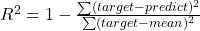
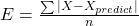
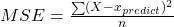

# 2주차 회귀 모델 학습
회귀의 개념과 **회귀 알고리즘**의 종류에 대하여 다룹니다

# 회귀 (Regression)
두 변수 사이의 관계를 분석하는 문제, 임의의 수치를 예측하는 문제

## KNN Regression (KNN 회귀)
데이터의 이웃한 **K개의** 데이터를 찾아 **이웃데이터의 평균**을 반환

**단점** : 테스트 데이터가 학습데이터와 많이 떨어져있다면 예측 어려움

## 회귀 모델 평가

### 결정 계수(coefficienct of determination)

예측값이 타깃들을 얼마나 설명해 주는지 알려주는 지표

1에 가까우면 성능 좋음, 0에 가까우면 성능 안좋음

- 근데 이거 의미하는 바가 뭔데?😵😵
	[[R] 결정계수(R-Squared)의 의미와 계산 방법](https://m.blog.naver.com/tlrror9496/222055889079)

### 절대오차 (Absolute Error)

실제값과 실험값의 차이를 절대값으로 나타낸 것

### 평균 절대 오차 (MAE = Mean Absolute Error)

-   절대 오차의 평균
-   직관적임
-   어디쪽으로 편양되었는지 알기 어려움

### 평균 제곱 오차 (MSE = Mean Square Error)

-   수학적인 분석이 쉬움
-   계산의 용이성 등

## 과적합
-   **과대적합(overfitting) 훈련세트**만 잘 맞는 모델 세로운 세트 예측에 대한 정확성이 떨어짐 **훈련점수** ≫ 테스트점수
-   **과소적합(underfitting) 모델이 단순(데이터 적음)**하여, 훈련이 덜 된경우
    **테스트점수** ≥ 훈련점수
-   **KNN 회귀모델에서 과소적합(underfitting) 해결법** 모델 풍부(**데이터 늘리기**)하게 하거나, 모델 복잡하게(**K 값을 감소**) 하면 됨
    

## 선형 회귀 (Linear Regression)
특성과 타깃관계를 잘 나타내는 **선형 방정식**을 찾는 문제
2차원에서는 **직선방정식**을 찾는 문제 계수, 가중치를 찾는 문제

y = ax + b

[점들을 대표하는 직선을 찾는 방법](https://youtu.be/91r8bzLcvuQ)

### 모델 파라미터

모델에서 학습을 통해 도출된 파라미터
선형 회귀 모델에서 계수와 가중치(a, b) 값을 의미함

## 다항 회귀 (Polynomial Regression)
다항식을 이용하여 방정식을 찾는 문제 **(선형회귀)**
단순히 선형 회귀에서 차수가 높은 변수를 추가해주면 된다

### 여기서 선형이란 😱😱
[선형성 - 위키백과, 우리 모두의 백과사전](https://ko.wikipedia.org/wiki/%EC%84%A0%ED%98%95%EC%84%B1)

**요약** : 2차항이 있어도 2차항 자체를 1차항으로 치환할 수 있으므로 선형이다

## 다중 회귀 (Multiple Regression)
2개 이상의 특성을 이용하여 선형회귀 분석 하는 것
결국 선형회귀와 원리는 같다. 변수만 추가된 것

### 특성 공학 (feature engineering)
기존 특성을 이용하여 새로운 특성을 만드는 행위

## 과대적합 방지 알고리즘

### 규제 (Regularization)
모델의 과대적합(Overfitting)을 방지하는 역할
**릿지**와 **라쏘**는 **선형 회귀 모델**에 규제를 추가한 모델입니다.

## 릿지 (Ridge)
계수의 제곱값을 기준으로 모델을 규제
계수의 크기를 줄여 과대적합 방지
더 많이쓰는 방식

## 라쏘 (Lasso)
계수의 절댓값을 기준으로 모델을 규제
릿지와 동일하게 계수의 크기를 줄여 과대적합 방지
계수의 값을 0으로 만들 수 있기에 **유용한 특성을 추적**하는데 **유용**

### 하이퍼파라미터
모델 학습 시 사람이 알려줘야하는 파라미터

# 라이브러리 사용법
[Google Colaboratory](https://colab.research.google.com/drive/1vQZ5pJk963UBnHY8GPuxsOk82tWekKsi?authuser=2#scrollTo=zR0LmwyAT-1A)

# 😵