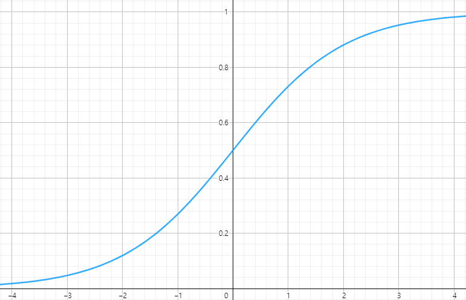

# 3주차 로지스틱 회귀 & 확률적 경사 하강법
회귀이지만 분류를 해주는 **로지스틱 회귀**와 많이 쓰이는 **확률적 경사 하강법**에 대하여 알아보도록 합시다

# 📈 로지스틱 회귀 **(Logistic Regression)**

### 로지스틱 회귀 이진분류

**선형 방정식**을 학습한 뒤, **시그모이드 함수(Sigmoid Function) = 로지스틱 함수(Logistic Function)**를 사용하여 **Class에 속할 확률**을 구하는 모델

$$ P = \frac{1}{1+e^{-f(X)}} $$

$$ f(X)=\omega X + \beta $$

### 로지스틱 회귀 다중분류

**각각의 feature**에 대하여 **선형방정식**을 학습한 뒤 **소프트맥스 함수(Softmax Function)**를 사용하여 **Class에 속할 확률**을 구하는 모델

## 〽 시그모이드 함수 **(Sigmoid Function = Logistic Function)**

$$ \phi=\frac{1}{1+e^{-z}} $$

오즈(odds)비의 log를 씌운 값을 변형(**로짓변환**)하여 얻어진 함수🤯

[로짓변환(logit transformation)](https://itpenote.tistory.com/519)

**선형 방정식**을 **확률로 변환**해준다고 생각하면 편합니다

로지스틱 회귀로 **이진분류**를 할 때 사용합니다

## 〽 소프트맥스 함수(Softmax Function)

$$ y_k = \frac{e^{a_k}}{\sum_{i=1}^{n}{e^{a_i}}} $$

[딥러닝-3.2. 활성화함수(3)-소프트맥스 함수(Softmax)](https://gooopy.tistory.com/53)

**특정 데이터**가 이 **클래스에 속할 확률**을 나타냅니다 (분모:전체, 분자:특정데이터)

**여러개**의 **선형 방정식**을 **확률로 변환**해줍니다

위의 이유로 지수함수를 사용하기에 **정규화된 지수 함수** 라고 부르기도 합니다

시그모이드함수(Sigmoid Function)에서 유도된 함수입니다

로지스틱 회귀로 **다항 분류**를 할 때 사용합니다

# 📉 확률적 경사 하강법

### 📋 점진적 학습(=온라인 학습)

새로운 데이터가 등장했을 때 **기존 학습모델**을 **버리지 않고** 새로운 데이터에 대해서 **더 훈련**하는 것 대표적으로 📉 **확률적 경사하강법**이 있습니다

## ✨ 경사 하강법

손실함수(Loss Function)의 경사가 가파른 부분을 따라 조금씩 내려오게 하는 모델

### 📉 확률적 경사 하강법

**하나의 샘플을 랜덤**하게 뽑아 가장 가파른 부분을 찾는 모델

**신경망 모델**에서 이 방법을 주로 사용합니다

**애포크(Epoch)** : 확률적 경사 하강법에서 훈련세트를 **한번**씩 **모두 사용**하는 과정

### 🎁 미니배치 경사 하강법

**여러개의 샘플**을 랜덤하게 뽑아 가장 가파른 부분을 찾는 모델

**신경망 모델**에서도 사용

### 🛒 배치 경사 하강법

**모든 샘플**을 이용하여 가장 가파른 부분을 찾는 모델

# 💪 손실함수(Loss Function)

**비용함수(Cost Function)**와 같은 뜻으로 머신러닝 알고리즘이 얼마나 **오류가 많은지 알려주**는 함수입니다.

**확률적 경사 하강법**에서 **학습의 기준**으로 쓰는 함수입니다.

**확률적 경사 하강법**은 조금씩 변화함으로 **손실함수**가 **미분가능(≒ 연속)**해야 합니다.

대부분의(?) 머신러닝 알고리즘이 손실함수를 기준으로 최적해를 찾아 나갑니다.

### 로지스틱 손실 함수 (Logistic Loss function)

로지스틱 회귀 이진 분류에서 사용할 수 있는 손실함수로, **이진 크로스엔트로피 손실 함수(Binary Cross-Entropy Loss function)**라고도 불립니다

로지스틱 회귀 다중 분류에서는 **크로스엔트로피 손실함수(Cross-Entropy Loss function)**라고 불립니다

$$ Loss(predict)=\begin{cases}-\log(predict), & if\ \ target = 1 \\ -log(l-predict), & if\ \ target = 0 \end{cases} $$

그밖에 손실함수로는 **MAE(평균 절대 오차)**, **MSE(평균 제곱 오차)** 등이 있습니다.

# 실습하기

[Google Colaboratory](https://colab.research.google.com/drive/1vQZ5pJk963UBnHY8GPuxsOk82tWekKsi?authuser=2#scrollTo=Ljv1O9O_qtYP)