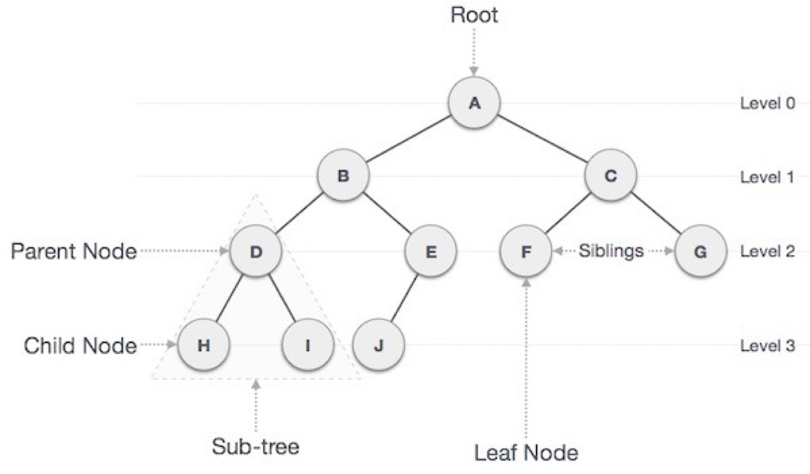
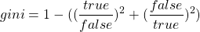

# 결정 트리 (Decision Tree)

## 트리 (Tree)

## 결정 트리

분류를 할 때 중간에 어떤 **특성을 기준**으로 **분류**하고 있는지 **보여줄 수 있는 방식**으로 학습하는 머신러닝 알고리즘

전처리가 필요없다는 것이 특징

어떤 Feature가 중요한지를 기준으로 학습할 수 있음

## 불순도

**지니 불순도 :**

결정트리 손실함수?

부모노드와 자식노드의 불순도가 크도록 설정하여 학습(=정보이득)

엔트로피 불순도 라는 불순도도 있음

# 교차검증과 그리드 서치

## 검증 세트 (Validation Set)

**개발 세트 (Dev Set)** 라고도 불림

추가 학습을 진행하려면 **모델이 현재 과소·과대적합**인지 알아야한다. 하지만, **Test Set을 사용**하면 추후 모델 평가 때 Test Score가 높게 나오는 **문제점**이 있다(≒ Train Set 다시 테스트). 모델 검증(과소·과대적합 확인)을 위해 Train Set에서 일부를 떼어 **검증 세트(Validation Set)**를 만든다.

테스트 셋과 검증 셋은 각각 **20~30%**의 비율로 나누는 것이 일반적이지만, 데이터가 충분히 크다면 적게 나누어도 문제 없음.

검증 세트(Validation Set)는 최적화 작업이 끝나고, 학습 세트(Train Set)에 포함되어 모델이 만들어짐.

## 교차 검증 (Cross Validation)

검증 과정을 여러번 수행하는 것, 모든 검증 과정의 평균을 검증 점수로 가진다

대표적으로 K-폴드 교차 검증(K-Fold Cross Validation)이 있다.

보통 5-폴드, 10-폴드 교차 검증을 애용함

학습데이터의 크기가 작다면, 대체로 교차 검증 방식을 사용함

### K-폴드 교차 검증(K-Fold Cross Validation)

**데이터**를 **K개로 분할**하여 **검증을 K**번 수행하는 것, **검증점수**를 **평균**하여 출력함

한번만 검증하는 것 보다 안정적인 검증점수를 얻을 수 있음.

## 하이퍼파라미터 튜닝

사용자가 지정해야 하는 파라미터(하이파 파라미터)를 튜닝하는 것

**AutoML** : 머신러닝이 하이퍼파라미터 튜닝을 자동으로 수행하는 기술

### 그리드 서치 (Grid Search)

**하이퍼파라미터 튜닝**과 **교차 검증**을 한 번에 수행해주는 사이킷런 도구

교차 검증을 하면서 **하이퍼파라미터**의 **최적값**을 구해줍니다

### 랜덤 서치 (Random Search)

그리드 서치에서 **하이퍼파라미터**를 **랜덤**으로 **생성**하여 **최적값**을 구해주는 사이킷런 도구

**확률분포 객체**를 전달하여 지정 횟수만큼 탐색합니다. **(균등분포 샘플링)**

매개변수 값의 범위를 설정하기 어려울 때 사용함

# 앙상블 학습 (Ensemble Learning)

정형 데이터에서 일반적으로 뛰어난 성과를 보이는 알고리즘

여러개의 모델을 학습시켜 종합된 결과를 출력하는 것

대체로 결정트리 알고리즘을 사용함

> **정형 데이터** : 구조가 있는 데이터 (데이터베이스, 엑셀 등)
> 
> **비정형 데이터** : 구조가 없는 데이터 (텍스트 데이터, 사진 등) - 신경망 알고리즘이 처리

## 랜덤 포레스트 (Random Forest)

부트스트랩 샘플들을 이용하여 여러번 훈련하여 최적의 값을 찾는 알고리즘

특성들은 sqrt(feature 수) 만큼 선택하여feature 를 골고루 사용할 수 있도록 한다

안정적인 성능을 가진다

부트스트랩 샘플 : 중복을 허용하여 뽑은 샘플

Oob

## 엑스트라 트리s

랜덤 포레스트에서 부트스트랩 샘플을 사용하지 않고, feature를 랜덤 분할을 하여, 불순도가 최대가 되는 값을 찾아 최적화 함

속도 빠름, 랜덤 포레스트보다 트리 개수를 늘려야 좋은 성능을 냄

## 결정 트리 기반 그레이디언트 부스팅

경사하강법과 비슷하게 로지스틱 손실함수, 평균제곱오차를 최저값이 되도록 트리를 만들어 가는 알고리즘

## 히스토그램 기반 그레이디언트 부스팅

Feature의 구간을 255개로 나누고 학습을 하는 알고리즘

1개는 사용되지 않은 값을 위해 남겨둠

## Permutation Importance

하나의 특성을 선택해서 섞어 성능을 측정하여 원래 데이터의 성능과 비교하여, 중요한 특성을 구분해주는 알고리즘

학습세트와 테스트세트를 사용할 수 있음

## 에이라 부스트

## 라이브러리

위의 그래디언트 부스트 학습 모듈은 아래의 라이브러리의 영향을 받아 만들어짐

### XGBoost

그래디언트 라이브러리

오픈소스

### LIGHTGBM

히스토그램 그래디언트 지원

Ms 오픈소스