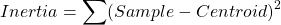

# 군집 알고리즘
* 비지도학습(Unsupervised Learning) : 타깃이 없이 학습하는 것
* 군집(Clustering) : 비슷한 샘플끼리 그룹으로 모으는 것
* 클러스터(Cluster) : 군집 알고리즘에서 만든 그룹

# K-평균 (K-Means)
* 군집 알고리즘을 이용하여 타깃이 없는 데이터를 군집화하여 평균을 구해줍니다
* 군집화된 평균이 클러스터(그룹)의 중앙에 있기 때문에 **클러스터 중심(Cluster Center)** 또는 **센트로이드(Centroid)**

## K-평균 (K-Means)
1.  무작위로 K개의 클러스터 중심을 정함
2.  클러스터 중심과 가까운 샘플을 한개로 묶음
3.  클러스터 샘플들의 평균을 클러스터 중심으로 설정
4.  클러스터 중심이 변화가 없을 때까지 2, 3 반복

## 엘보우 (Elbow)
* K-Means 알고리즘에서 적절한 K값을 찾기 위한 알고리즘
* **이너셔(Inertia)**의 감소속도가 꺾이는 시점이 최적의 K값

### 이너셔 (Inertia)

샘플이 클러스터 중심에서 얼마나 가까운지를 나타내는 값

# 주성분 분석
* 차원 축소 : 데이터의 특성 수를 줄이는 것, 데이터를 잘 나타내는 특성의 크기를 줄여 학습모델의 성능을 높일 수 있다.
* 주성분 분석(PCA = Principal Component Analysis) : 대표적인 차원 축소 알고리즘

[[선형대수학 #6] 주성분분석(PCA)의 이해와 활용](https://darkpgmr.tistory.com/110)

## 주성분 분석
* 데이터의 분산이 큰 방향을 찾는 것
* 주성분(Principal Component) : 분산이 큰 방향으로 뻗어 있는 벡터
* 주성분을 이용하여 차원 축소를 할 수 있습니다.

### 설명된 분산 (Explained Variance)
* 주성분이 원본데이터의 분산을 얼마나 잘 표현한지 나타낸 것