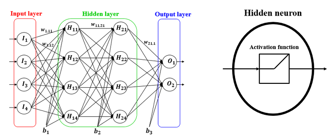
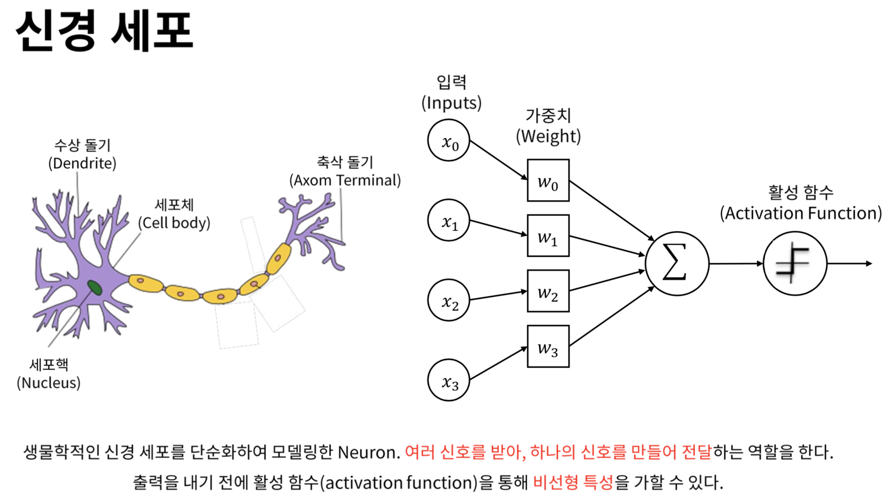
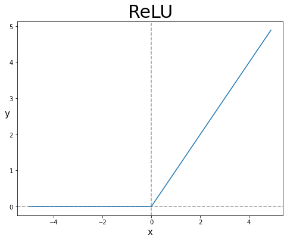

# 로지스틱 회귀와 인공신경망

## 인공 신경망 용어
* **입력층(Input Layer) :** 데이터의 feature를 말함
* **은닉층(hidden Layer) :** 입력층과 출력층 사이에 있는 밀집층
* **출력층(Output Layer) :** 신경망의 최종결과를 만드는 층
* **뉴런(Neuron), 유닛(Unit) :** z값을 계산하는 단위, 선형 계산을 수행함
* **활성화함수(Activation Function) :** 선형방정식의 결과를 확률로 바꿔주는 함수, 로지스틱 회귀에서는 시그모이드 또는 소프트맥스함수를 말한다, 이 활성화 함수를 하나의 층으로 구분하는 경우도 있음
* **밀집층(Dense Layer) :** 이전 Layer에서 오는 가중치들을 이용하여 값을 계산해주는 층(Keras.layers)
* **완전연결층(Fully Connected Layer) :** 양쪽의 뉴런들이 서로를 모두 연결하고 있는 층

## 매컬러-피츠 뉴런
* 워런 매컬러와 원터 피트가 제안한 **뉴런 모델**로, 생물학적 뉴런이 신호가 **임계값이 넘으면 활성화** 되어 다른 세포에 신호를 전달한다는 것을 기반으로 만들어 짐. (=위 모델)
* 실제 생물학적 뉴런과는 거리가 먼 알고리즘임

## 경사하강법을 이용한 로지스틱 회귀 알고리즘
* 인공신경망의 가장 단순한 예시로, 입력층과 출력층만 존재하는 알고리즘

## 원-핫 인코딩 (One-Hot Encoding)
* 노드에서 타깃값만 1로 만들고 나머지 값은 0으로 만들어 주는 것

# 심층 신경망 (DNN : Deep Neural Network)
* 단순 인공 신경망에서 **은닉층**을 추가한 인공 신경망

## 활성화 함수

### 은닉층 활성화 함수
* 은닉층에는 활성화 함수를 사용해야 한다.
> 뉴런들은 선형계산(덧셈, 곱셈) 만을 수행한다. 만약 은닉층에 활성화 함수가 존재하지 않는다면, **입력층과 출력층을 하나의 선형방정식**으로 만들 수 있게 된다. 때문에 은닉층이 의미가 없어진다. 따라서 Log함수와 같은 활성화 함수를 이용하여 **은닉층의 연산을 비선형적**으로 만들어 주어야 한다.

### 출력층 활성화 함수

분류 알고리즘에서 다중분류인 경우에는 Softmax함수, 이진분류인 경우에는 Sigmoid함수를 이용한다. 또한 신경망을 이용한 회귀는 출력층에 활성화 함수를 쓰지 않는다는 것이 특징이다.

### 렐루 함수 (ReLU)
* 음수일 때는 0, 양수일 때는 출력해주는 함수
* **이미지처리, 심층 신경망** 알고리즘에 뛰어나다고 알려져있음
* 시그모이드 함수가 양쪽끝으로 갈 수록 변화가 작다는 것을 보완하여 만들어진 함수

## 옵티마이저
* 경사하강법 알고리즘들을 말함

### 경사하강법 옵티마이저

**모멘텀 최적화 (Momentum Optimizer) :** 그라이디언트를 가속도 처럼 사용하는 기능

**네스테로프 모멘트 (Nesterov Momentum Optimizer) :** 네스테로프 가속 경사, 모멘텀 최적화를 2번하여 구현, 경사하강법 보다 나은 성능을 보여줌

**적응적 학습률 (Adapive Learning Rate) :** 모델이 최적점에 가까이 갈수록 학습률을 낮추는 방법, 안정적으로 최적점에 도착할 수 있음

# 드롭아웃 (Dropout)
* 제프리 린턴이 소개함
* 특정 뉴런의 노드의 출력을 0으로 만들어 노드의 의존도를 적절하게 나누어 과대적합을 막는 기술

## 조기종료 (Early Stopping)
* 과대적합이 진행되기 전에 훈련을 종료하는 것, 케라스의 콜백을 이용하여 구현할 수 있음