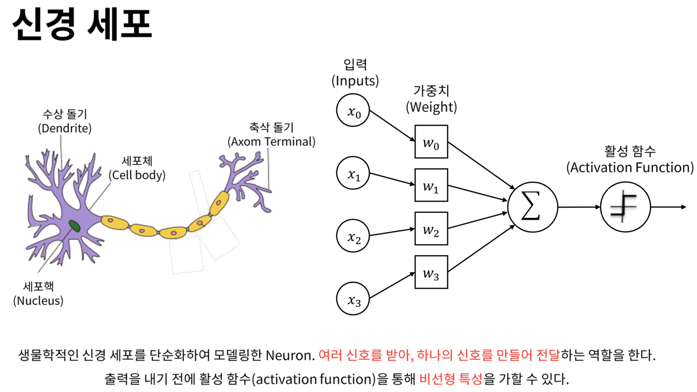

# 합성곱신경망 (CNN : Convolution Neural Network)

## ❎ 합성곱 (Convolution)
* 일정한 구간의 필터(커널)을 설정한 뒤 가중치를 설정한 후, 실제 픽셀을 가중치*픽셀의 합을 구간마다 구해주는 것
* 이때 필터(커널)의 가중치는 나중에 모델을 훈련할 때 경사하강법을 이용하여 구함.
* 픽셀을 데이터 하나씩만 보는것이 아닌 관련된 주변 데이터까지 볼 수 있다는 점이 강점임.

## 🎇 합성곱 필터 (Filter)
* 뉴런(Neuron) = 필터(Filter) = 커널(Kernel)
* 일정 크기의 가중치를 가지고 있으며, 합성곱 신경망의 **새로운 입력데이터(특성 맵)**를 만들기 위해 생겨남
* 필터를 여러 개를 만들어서 **특성 맵**을 **여러 개** 만들 수도 있음.
* 입력이 3차원인 컬러 이미지는 **필터의 크기도 3차원**으로 만들어 2차원으로 축소시킬 수 있음.
* 가중치는 모델을 훈련할 때 설정됨.

## 🗺️ 특성 맵 (Feature Map)
* 입력 데이터에서 **합성곱 연산**을 통해 얻은 **새로운 데이터**

## ↔ 패딩 (Padding)
* 입력 데이터의 주위를 특정 값으로 채우는 것
* 주로 합성곱을 할 때 중간에 있는 **입력 데이터에 치중되지 않도록** 하기 위해 사용 함.
* **세임 패딩(Same Padding) :** 주위의 값을 0으로 채우는 것
* **밸리드 패딩(Valid Padding) :** 패딩을 사용하지 않는 것

## ➡ 스트라이드 (Stride)
합성곱 연산을 할 때 필터를 **‘얼마나’ 움직이면서 연산**을 할 지 설정하는 것

## 💫 풀링 (Pooling)
* 특성 맵을 만들 때 처럼 일정 크기의 구간을 보면서 값을 줄이는 것
* 특성 맵과 다른 점은 가중치가 없고, 그 대신 입력값을 대표하는 값을 뽑는 것이 특징.
* **최대 풀링(Max Pooling):** 영역에서 가장 큰 값을 고르는 것
* **평균 풀링(Average Pooling):** 영역의 평균값으로 고르는 것

## ✨ 합성곱 신경망의 시작
* 풀링된 데이터를 1차원으로 풀어서 인공신경망의 Input값으로 설정한다.

