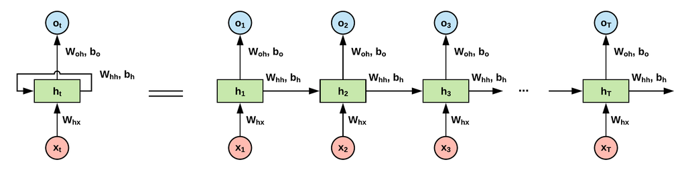
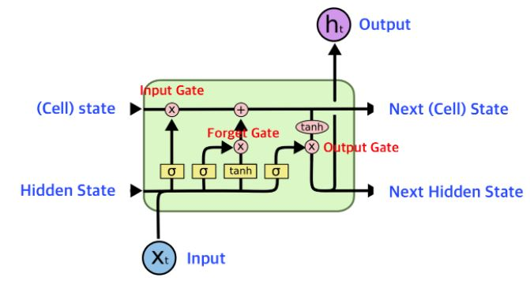
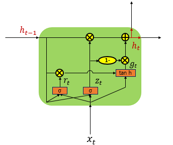

# 피드포워드 신경망 (Feedforword Neural Network)

-   이전 데이터에 관한 값을 학습하지 않는 신경망
-   순서가 중요한 데이터에는 적합하지 않음
-   합성곱 신경망, 완전 연결 신경망이 대표적인 예시

# 순환 신경망 (RNN : Recurrent Neural Network)

-   순서가 중요한 **순차 데이터(Sequential Data)**, **시계열 데이터(Time Series Data)** 와 같은 데이터를 학습하기 좋은 신경망 알고리즘
-   기본적으로 데이터를 순차적으로 넣으면서, 신경망에서 이전 데이터에 대한 결과값을 다시 신경망에 넣어 **현재 데이터 + 이전 데이터 결과 값** 을 **학습**하는 형태

## 토큰

-   단어를 숫자로 변환하여 나타내는 것
-   일반적으로 0은 NULL문자, 1은 시작문자, 2는 단어사전에 없는 문자를 뜻하고, 나머지를 채워나간다
-   **단어 사전 :** 해시처럼 “숫자 → 단어”로 매핑하는 것, 단어 사전의 개수를 제한하여 속도를 올릴 수 있음.

## 원 핫 인코딩

-   토큰은 서로 다른 숫자기 때문에 곱해지면서, **큰 숫자**가 자동적으로 **큰 가중치**를 가지게 되는 것 처럼 보이게 됨.
-   위 내용을 방지하기 위해 단어사전 길이의 배열을 이용하여 **원 핫 인코딩**하여 모델을 훈련 함

## 단어 임베드

-   원 핫 인코딩 또한 데이터가 많아지므로 서로 다른 임의의 **실수 벡터**를 만들어 단어를 분류함
-   실수 벡터를 이용하여 단어 간의 연결관계를 표현할 수 있어, **성능이 향상** 됨

# LSTM (Long Short-Term Memory)

-   **셀 상태(Cell State)**를 추가한 신경망
-   단기 기억을 오랫동안 하기 위해 만들어짐 (일반적인 순환신경망(RNN)은 데이터가 들어올수록 앞에 있는 데이터들은 희석 됨)

# GRU (Gated Recurrent Unit)

-   LSTM을 간소화 한 버전
-   LSTM보다 계산량이 적고(가중치 개수 적음), 계산량 대비 성능이 좋음

